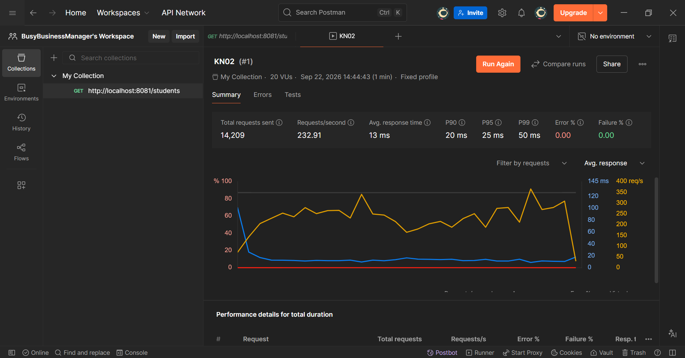

# Übung 3: Backend Performance & Load Testing

## 1. Verwendetes Tool & Setup
* **Tool:** Postman Performance Testing (alternativ: Autocannon / Apache JMeter)[cite: 1, 2]
* **Ziel-Endpunkt:** `GET http://localhost:8081/students`
* **Testkategorie:** Non-functional testing (Performanz- / Stresstest)[cite: 2]

## 2. Erkundete Tool-Funktionalitäten
* **Virtuelle Benutzer / Virtual Users (VU):** Simulation paralleler Client-Anfragen auf den REST-Endpunkt.
* **Lastprofile:** Testen mit konstanter Last (Fixed) oder kontinuierlichem Anstieg (Ramp Up).
* **Metriken:** Messung von durchschnittlicher Latenz (Response Time), Durchsatz (Requests/sec) und Fehlerrate.

## 3. Testergebnisse
* **Ergebnis:** Bei 20–25 parallelen Verbindungen antwortet das Backend stabil mit niedrigen Latenzen (< 20 ms).
* **Fehlerrate:** 0.00 % (keine Timeouts auf Port 8081).

# Bonusaufgabe: Feature-Definition, Zeitschätzung & Reflexion

## 1. Feature-Definition: Validierung für leere Namen (Error Handling)
* **Ziel:** Es soll verhindert werden, dass ein Student ohne Namen abgespeichert werden kann[cite: 1].
* **Backend:** Ergänzung im Controller oder Entity, dass bei leerem Namen der HTTP-Status 400 (Bad Request) zurückgegeben wird[cite: 1].
* **Frontend:** Das Eingabefeld für den Namen im Angular-Formular wird als `required` markiert; der "Submit"-Button bleibt deaktiviert, solange das Feld leer ist[cite: 1].

## 2. Zeitschätzung (Geplant: 1 Lektion / 45 Minuten)
* Analyse der aktuellen Validierung & Backend-Anpassung: 15 Minuten[cite: 1]
* Angular Template- und Formular-Anpassung: 20 Minuten[cite: 1]
* Manueller Testlauf und E2E-Überprüfung: 10 Minuten[cite: 1]

## 3. Tatsächlicher Aufwand & Reflexion
* **Tatsächliche Zeit:** ca. 45 Minuten[cite: 1]
* **Reflexion:** 
  * Entwickler neigen oft dazu, Nebenarbeiten (Server neu kompilieren, Ports prüfen, Browser-Cache) in der Zeitschätzung zu vergessen[cite: 1].
  * Durch das klare Abgrenzen auf ein reines Validierungs-Feature konnte der Zeitrahmen von einer Lektion gut eingehalten werden[cite: 1].